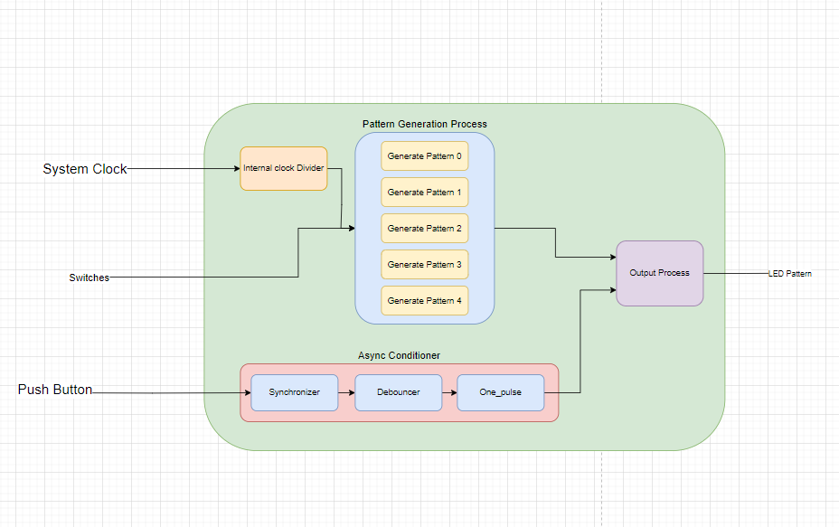
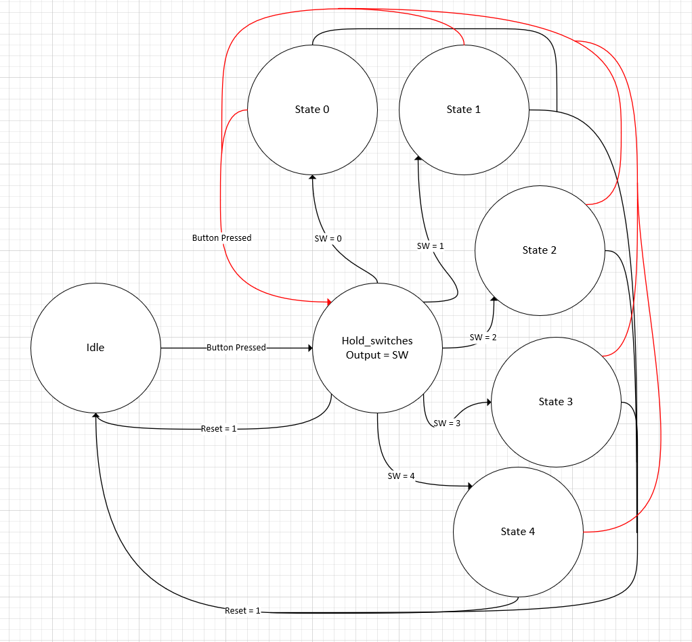

# Lab 4 : LED Pattern Generation on DE10-Nano

## Overview 
Create a System on the DE10-nano to produce Variious LED Patterns based on dip switches and button input from the user. 

## Deliverables

### System Block Diagram

### State Diagram
