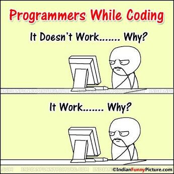

# This is a first level heading
## This is a second level heading
### This is a third level heading

**Woah its bold**

*I think this is how to do italics*

```
This 
is a 
Block 
Quote
```

> [!NOTE]
> This is a note I think


```C
main(){
    for (i<1000,i=0,i++){
        
    }

}
```


|Header 1| Header 2|
|--------|---------|
|Data|  moredata|
|Blah|Blah|


- Unordered list
- List of more list stuff
- aaaa more list


1. This is my ordered list
2. More Order
3. Order in the court 

This is totally a normal [link](https://www.youtube.com/watch?v=dQw4w9WgXcQ)


