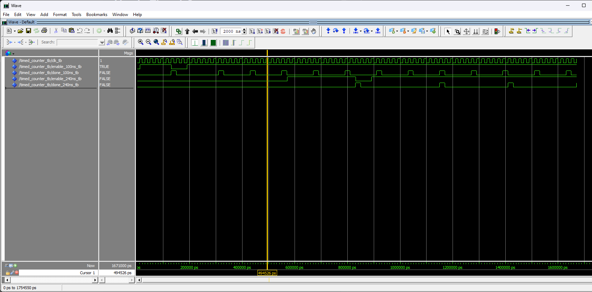
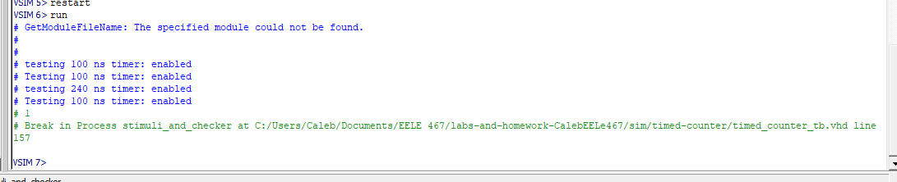

# Hw 4 : Timed Counter

## Overview
    The goal of this assignment was to create a synchronous counter that counts for a specified period of time. 

# Deliverables

Counter screenshot with 100ns and 240ns timer

Terminal readout of simulation

